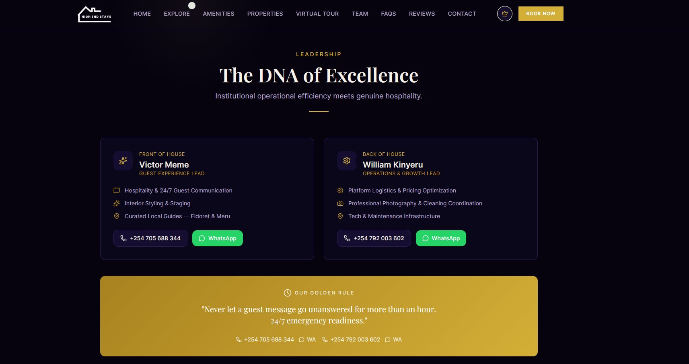
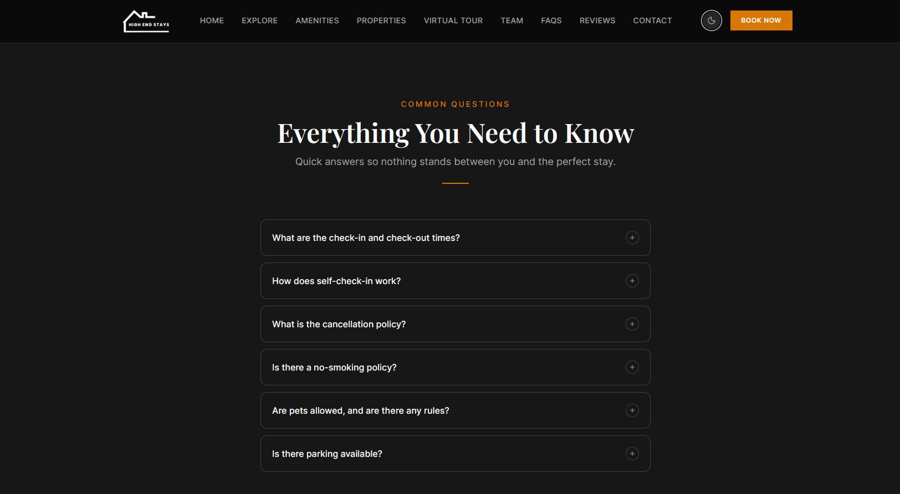
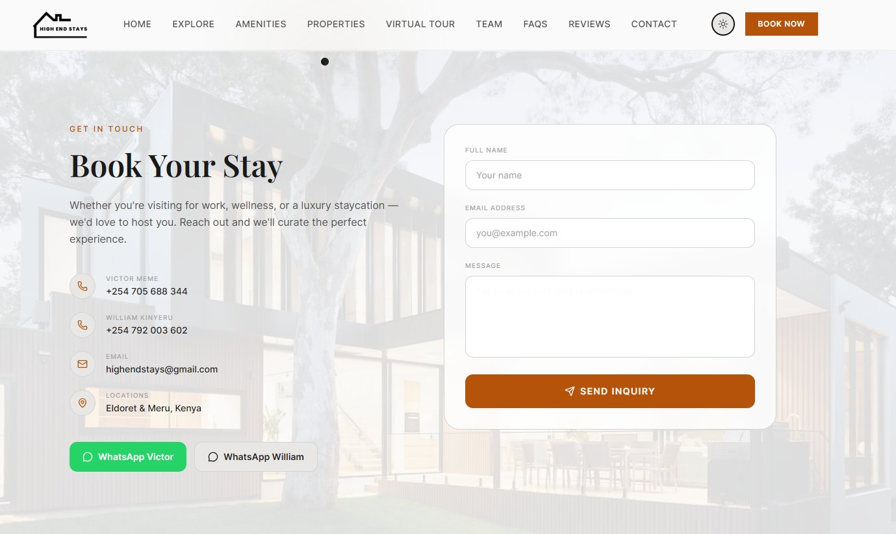

# High End Stays BnB

> Premium luxury short-stay rentals in **Eldoret** and **Meru, Kenya** — crafted for guests who expect more.

🌐 **Live Site:** [high-end-stays.vercel.app](https://high-end-stays.vercel.app)

---

## 📸 Preview

The site ships with **three switchable themes** — toggled via the icon in the navbar (Moon → Sun → Crown → repeat).

### 👑 Royal Theme
*Deep navy with gold accents — ultra-premium, regal aesthetic*



---

### 🌑 Dark Theme
*Deep blacks with warm amber/orange — the signature luxury-dark look*



---

### ☀️ Light Theme
*Warm off-white with charcoal text — clean, airy, editorial feel*



---

## ✨ Features

- **Three switchable themes** — Dark, Light, and Royal (toggled live, no reload)
- **360° Virtual Tours** — Interactive WebGL panoramas powered by Three.js, touch-friendly on mobile
- **Filterable property grid** — Browse listings by location (All / Eldoret / Meru)
- **Detailed listing cards** — Price, amenities, ratings, and one-tap WhatsApp booking
- **Responsive design** — Optimised for mobile, tablet, and desktop
- **Smooth animations** — Staggered scroll reveals and micro-interactions throughout
- **FAQ accordion** — Instant answers to common guest questions
- **Book Your Stay form** — Direct inquiry with WhatsApp shortcuts
- **Team section** — Contact Victor or William directly from the site

---

## 🚀 Getting Started

```bash
npm install
npm run dev
```

Open [http://localhost:5173](http://localhost:5173) in your browser.

---

## 🏗️ Tech Stack

| Tool | Purpose |
|---|---|
| **React 18** + **TypeScript** | UI framework |
| **Vite** | Dev server & build tool |
| **Tailwind CSS v4** | Utility-first styling |
| **Three.js** | 360° WebGL panorama renderer |
| **React Router** | Client-side routing |
| **Lucide React** | Icon library |

---

## 📁 Project Structure

```
src/
├── components/
│   ├── Navbar.tsx              # Sticky nav with theme switcher
│   ├── HeroSection.tsx         # Full-screen slideshow + search bar
│   ├── ExploreSection.tsx      # Filterable property grid (Eldoret / Meru)
│   ├── AmenitiesSection.tsx    # Premium amenities showcase
│   ├── ListingsSection.tsx     # Detailed listing cards with virtual tour
│   ├── VirtualTour.tsx         # 360° WebGL panorama component
│   ├── VirtualTourSection.tsx  # Standalone Virtual Tour section
│   ├── TeamSection.tsx         # Victor & William team cards
│   ├── FAQSection.tsx          # Accordion FAQ
│   ├── ReviewsSection.tsx      # Guest testimonials
│   ├── ContactSection.tsx      # Book Your Stay form + contact info
│   ├── Footer.tsx
│   └── MouseFollower.tsx
├── pages/
│   └── index.tsx               # Main page — assembles all sections
├── types/
│   └── listings.ts
├── assets/uploads/             # Logo + screenshot previews
├── theme.css                   # Three themes (Dark / Light / Royal)
├── providers.tsx               # Theme + Booking context
└── main.tsx
```

---

## 🎨 Themes

| Theme | Class on `<html>` | Background | Accent |
|---|---|---|---|
| 🌑 **Dark** (default) | *(none)* | `#0a0a0a` | Amber `#d97706` |
| ☀️ **Light** | `.theme-light` | `#fafafa` | Deep amber `#b45309` |
| 👑 **Royal** | `.theme-royal` | `#06030f` | Gold `#D4AF37` |

---

## 🗺️ Page Sections

| Section | Nav Link | Description |
|---|---|---|
| Hero | HOME | Full-screen slideshow + location search |
| Explore | EXPLORE | Filterable property cards by city |
| Amenities | AMENITIES | 6 premium amenity highlights |
| Properties | PROPERTIES | Listing cards with inline 360° tours |
| Virtual Tour | VIRTUAL TOUR | Standalone 360° room explorer |
| Team | TEAM | Victor & William with direct contact |
| FAQs | FAQS | Accordion-style common questions |
| Reviews | REVIEWS | Verified guest testimonials |
| Contact | CONTACT | Booking inquiry form + WhatsApp |

---

## 📍 Properties

| Location | Property | Type | Price | Status |
|---|---|---|---|---|
| Eldoret | Pioneer Heights | Studio | KES 8,500/night | ✅ Live |
| Eldoret | MTRH Executive | Studio | KES 7,500/night | ✅ Live |
| Eldoret | Family Haven | 2-Bedroom | KES 12,000/night | ✅ Live |
| Eldoret | City View Penthouse | Penthouse | KES 18,000/night | 🔜 Coming Soon |
| Meru | Makutano Premium | Studio | KES 9,000/night | ✅ Live |
| Meru | Mt. Kenya Royal Suite | Luxury | KES 15,000/night | ✅ Live |
| Meru | Garden Retreat | Villa | — | 🔜 Coming Soon |
| Meru | Forest Edge Lodge | Lodge | — | 🔜 Coming Soon |

---

## 📞 Contact

| | Name | Phone | WhatsApp |
|---|---|---|---|
| Guest Experience | **Victor Meme** | +254 705 688 344 | [wa.me/254705688344](https://wa.me/254705688344) |
| Operations | **William Kinyeru** | +254 792 003 602 | [wa.me/254792003602](https://wa.me/254792003602) |

📧 **Email:** highendstays@gmail.com  
📍 **Locations:** Eldoret & Meru, Kenya

---

## 🏗️ Build for Production

```bash
npm run build
```

Output goes to `dist/`. Deploy to any static host — Vercel, Netlify, or Cloudflare Pages.

---

© 2026 High End Stays BnB. All Rights Reserved.  
Designed & Developed by **Victor Meme**.
